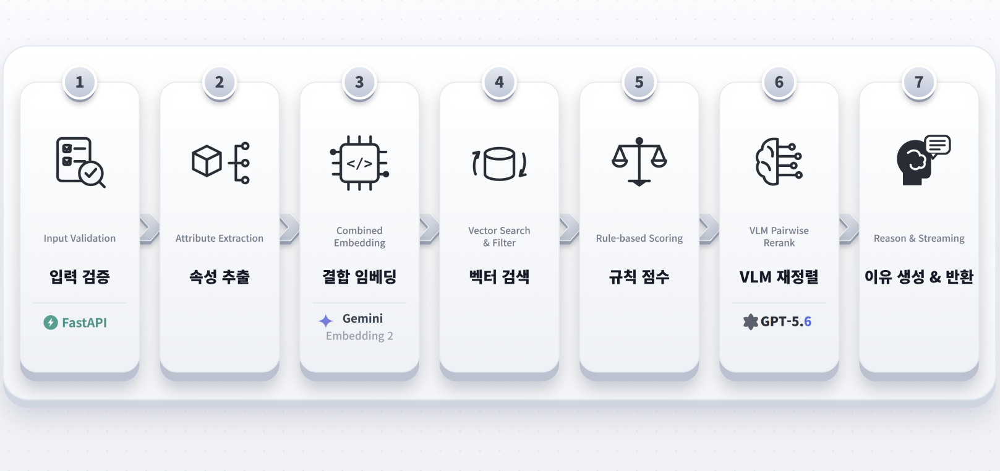
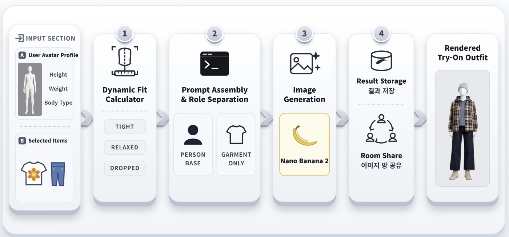
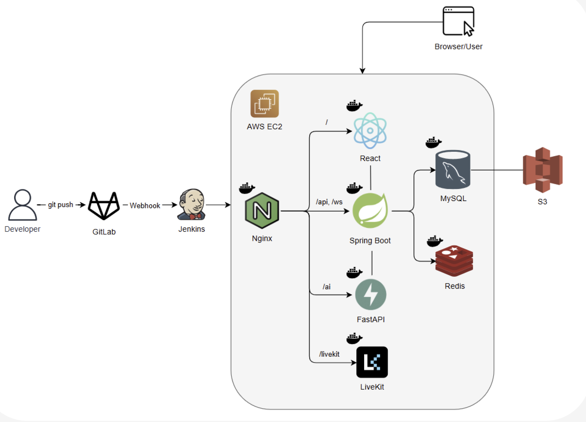

# 고르디 (Gordi)

> AI가 취향에 맞는 옷을 추천하고, 친구들과 함께 비교하며 고를 수 있도록 돕는 패션 의사결정 서비스

고르디는 수많은 상품 사이에서 무엇을 골라야 할지 고민하는 과정을 줄여 줍니다. 사용자의 카테고리, 예산, 선호 무드와 프로필을 바탕으로 어울리는 상품을 추천하고, 아바타 가상 피팅으로 착장 이미지를 미리 확인할 수 있습니다. 혼자 결정하기 어렵다면 친구를 초대해 실시간 공동 티어메이커에서 후보를 정리하고 최종 상품을 함께 선택할 수 있습니다.

## 주요 기능

### 맞춤형 프로필과 아바타

- 성별과 선택 입력인 키·몸무게 범주, 체형을 바탕으로 사용자 아바타를 구성합니다.
- 체형 상세 입력을 생략하면 성별에 맞는 표준 아바타를 제공합니다.
- 프로필과 아바타는 마이페이지에서 다시 수정할 수 있습니다.

### AI 상품 추천

- 상의, 하의, 아우터, 원피스/세트, 신발, 가방 중 원하는 카테고리를 선택합니다.
- 예산 범위와 여러 개의 선호 무드 태그를 추천 조건으로 사용할 수 있습니다.
- 상품 이미지와 설명, 카테고리의 임베딩 유사도에 규칙 기반 점수와 VLM 재정렬을 결합해 후보를 추천합니다.
- 마음에 들지 않는 상품만 골라 새로운 후보로 다시 추천받을 수 있습니다.



### AI 가상 피팅

- 아바타 프로필과 선택한 의상을 조합해 가상 착장 이미지를 생성합니다.
- 사용자의 체형 정보와 의상 카테고리를 바탕으로 착용 방식을 반영합니다.
- 생성 결과를 방 참여자들과 공유하고 세션 결과에 저장할 수 있습니다.

> 가상 피팅 이미지는 상품 비교를 돕기 위한 시각화이며 실제 신체 치수나 핏을 보장하지 않습니다.



### 친구와 같이 고르기

- 추천 상품을 후보로 등록해 최대 6명이 참여하는 방을 만들고 초대 링크를 공유합니다.
- 참여자 현황과 공동 보드는 실시간으로 동기화됩니다.
- 모든 참여자가 상품을 S·A·B 등의 티어로 분류하고 티어 안의 순서를 함께 조정합니다.
- 음성 대화를 이용하며 후보를 비교하고, 최종 상위 상품을 확정할 수 있습니다.

### 결과와 기록

- 확정된 상위 1~3개 상품의 이미지, 브랜드, 상품명, 가격과 순위를 확인합니다.
- 판매처 링크가 있는 상품은 외부 구매 페이지로 이동할 수 있습니다.
- 회원은 이전 선택 결과와 당시의 상품 정보, 추천 조건을 내 기록에서 다시 확인할 수 있습니다.

## 시스템 아키텍처

React 클라이언트, Spring Boot API, FastAPI 기반 AI 서비스와 LiveKit을 Nginx가 단일 진입점에서 연결합니다. MySQL은 서비스 데이터를, Redis는 실시간 상태와 캐시를 담당하며, 배포는 GitLab과 Jenkins를 통해 AWS EC2 환경으로 이어집니다.



## 프로젝트 폴더 구조

```text
S15P11D105/
├── docs/
│   ├── 01_중간평가1/        # 평가1
│   ├── 02_중간평가2/        # 평가2
│   ├── 03_중간평가3/        # 평가3
│   ├── 04_최종평가/         # 마지막 평가
│   │
│   ├── images/              # 마크다운 문서들에 삽입할 공통 이미지
│   └── README.md            # docs 폴더 전체 목차 및 안내
│
├── frontend/
├── backend/
├── ai/
└── README.md
```

## 로컬 Docker 실행

> Docker 이미지 빌드에는 시간이 걸릴 수 있습니다. 평소에는 각 서비스를 로컬에서 개발하고, 통합 확인이 필요할 때 Docker 환경을 사용하는 것을 권장합니다.

### 데이터베이스 실행

```bash
docker compose up -d
```

### 애플리케이션 실행

전체 서비스를 한 번에 실행합니다.

```bash
docker compose -f docker-compose.local.yml up -d --build
```

필요한 서비스만 개별적으로 실행할 수도 있습니다.

```bash
docker compose -f docker-compose.local.yml up -d --build frontend
docker compose -f docker-compose.local.yml up -d --build backend
docker compose -f docker-compose.local.yml up -d --build ai
docker compose -f docker-compose.local.yml up -d --build nginx
```

여러 서비스를 함께 지정할 수도 있습니다.

```bash
docker compose -f docker-compose.local.yml up -d --build backend ai
```

### 접속 주소

| 서비스 | URL |
| --- | --- |
| 프론트엔드 | <http://localhost/> |
| 백엔드 API | <http://localhost/api/> |
| AI API | <http://localhost/ai/> |
| Swagger UI | <http://localhost/api/swagger-ui/index.html> |

> 로컬 서버와 Docker 컨테이너를 동시에 실행하면 포트가 충돌할 수 있으므로 한 가지 환경만 실행해 주세요.


