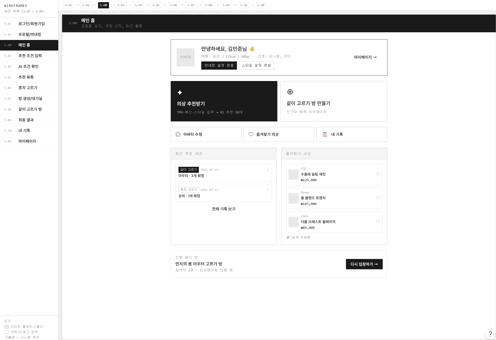

## 프론트엔드 팀장 담당 + 환경설정

- 네이밍 규칙 정하기 (컴포넌트, 함수/변수/훅, 클래스명, 커스텀훅(use), 이벤트(handle), 타입명)
- 기술스택 정리 + 폴더 구조
- Prettier 설정
- Github Issue, PR 템플릿 적용

 

## 아이디어 제안

- **동작 비교**
  - 하나의 정답을 기준으로 하는 기존 자세교정 서비스는 개개인의 환경을 고려할 수 없음
    - 악기연주 : 선생님과 학생의 손모양을 비교
    - 운동 : 자세분석 기능을 활용하여 트레이너의 자세와 회원의 자세를 비교
    - 보편적 자세비교 기능 ⇒ 활용도는 높아짐
  - 정확한 자세 비교를 위한 AI 수치 데이터 제공 + 실시간 화상통화 피드백
  - 정답자세X(선생님 자세 기반) + 여러 카메라 활용가능 +
- **화상회의 피드백**
  - 회의 과정, 결과를 AI가 분석하여 발화량 균형, 끼어들기 빈도, 결정사항 자동정리, 할일 자동정리, 회고 템블릿 생성 등을 자동으로 수행
  - 분석 결과를 저장하고 회의 종료 후 전체 피드백 제공
  - 다음 회의 시작전 혹은 도중에 피드백 주기 (골고루 말해보라는 등)
  - 진행자용 기능을 제공하는 것도 좋을듯
- **공동 학습 보조**
  - 각자의 학습 내용을 기존 스터디와 같은 형식으로 설명
    1. 동일주제일 경우 AI가 해당 내용을 요약 및 오류 검증하여 제공 + 관련 퀴즈 제공
    2. 자동 지식 그래프 누적 : 매 스터디마다 학습한 내용을 자동으로 요약/저장
    3. 각자의 학습 자료를 제공할 수 있다면 ⇒ 각 스터디 참여자의 지식 차이를 분석하고 서로 가르칠 수 있는 or 배울 수 있는 내용을 찾아 스터디 진행방식 추천 등
- **중고거래 물건 검수**
  - 판매자가 실시간으로 구매자에게 영상으로 물건 검수
  - AI의 확인 체크리스트
- **동작 비교**
  - 악기연주 : 선생님과 학생의 손모양을 비교
  - 운동 : 자세분석 기능을 활용하여 트레이너의 자세와 회원의 자세를 비교
  - 보편적 자세비교 기능 ⇒ 활용도는 높아짐
- **카메라를 활용한 미션 게임**
  - 특정 색상의 물건 보여주기
  - 특정 제스쳐 하기 등
- **화상회의 피드백**
  - 회의 과정, 결과를 AI가 분석하여 발화량 균형, 끼어들기 빈도, 결정사항 자동정리, 할일 자동정리, 회고 템블릿 생성 등을 자동으로 수행
  - 분석 결과를 저장하고 다음 회의에 피드백 주기 (골고루 말해보라는 등)
- **실시간 수어 번역**
- **안전 동행**
  - 귀가/현장방문/중고거래 등의 상황에 친구, 가족이 카메라로 동행
  - 위치, 소리 등 공유
  - 일정시간 무응답 감지, 실시간 상황 감지
- **갈등중재 화상 통화**
  - 중고거래, 팀회의, 가족간대화, 계약조율 등의 상황에 감정분석 후 피드백
  - 말을 끊는 빈도, 표현의 강도, 합의된 내용 자동 정리, 감정 상태 분석 등 실시간 피드백
  - 중립적 대화를 하는데 도움이 될 수 있음
- **공동 학습 보조**
  - 공동 주제로 각자 집에서 스터디 등을 수행할때 각자의 학습 환경 촬영 or 화면 녹화
  - 카메라로 학습 상태 점검 (제대로 집중하고 있는지, 졸고있는지 등)
  - 각자의 공부 내용을 모아서 gpt가 각자의 학습량 비교 및 학습 내용 요약 제공

 

## 기능 명세 작성 및 아이디어 고도화

- 기능 및 사용자 흐름 개선안 제시
- 2D 아바타 착장 및 혼자 고르기 기능 고도화
- 2D 아바타 페이지 기능 구현 우선순위 설정

 

## 와이어 프레임 제작

- 기능 요구사항 작성 및 고도화를 위한 와이어프레임 초안 제작

