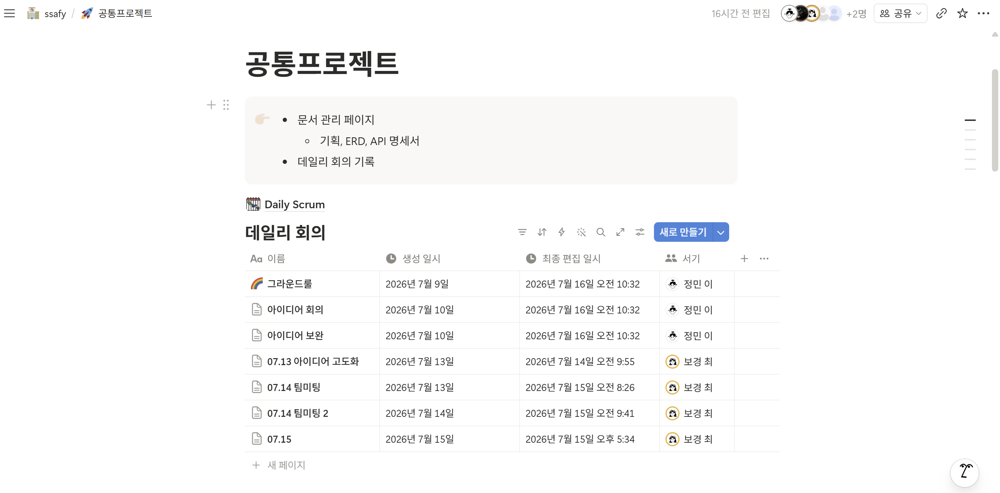
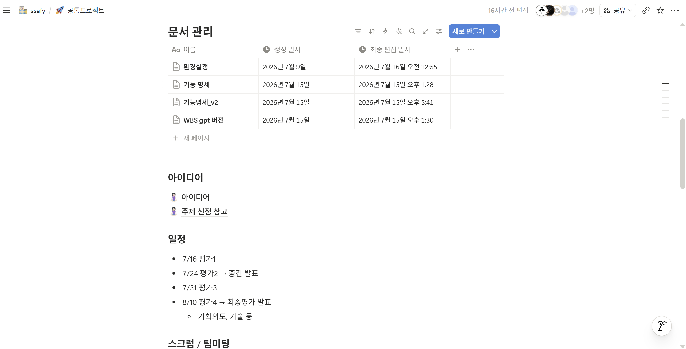
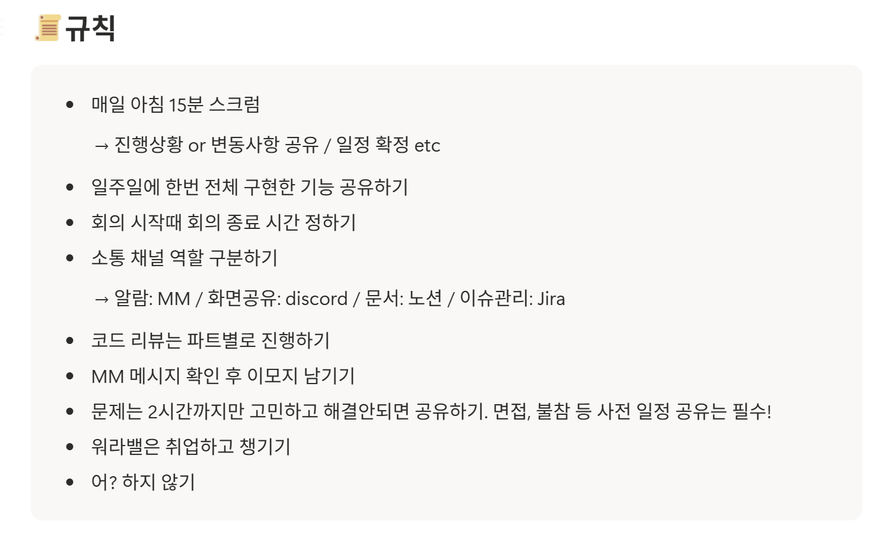
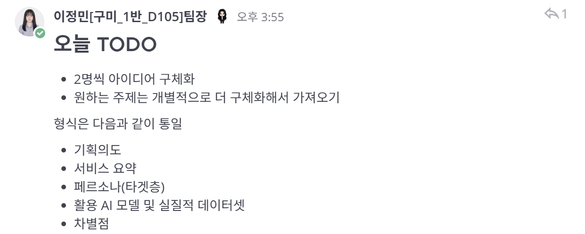
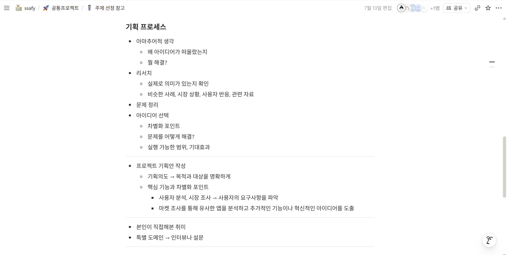
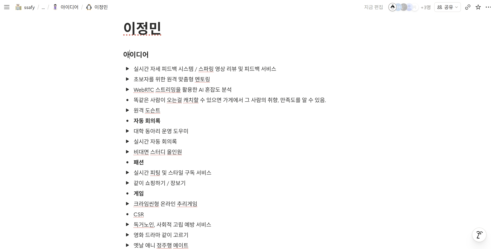
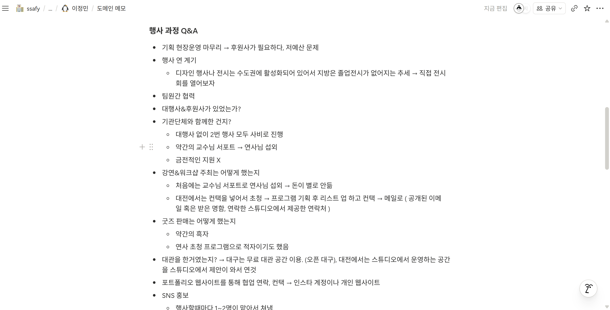
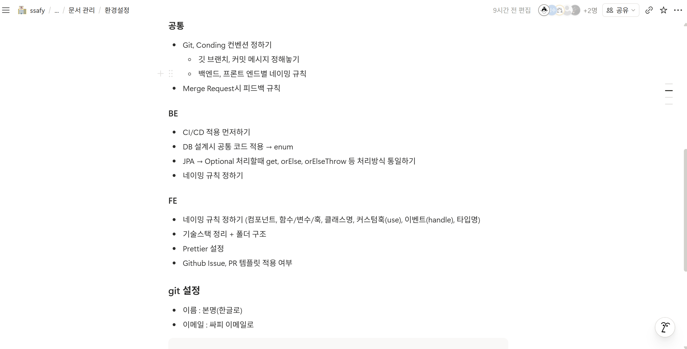

# 15기 공통 프로젝트 D105 이정민 Sub1 평가자료

## 역할 요약

Sub1 기간 동안 **팀장으로서 팀의 협업 기반을 마련하고, 아이디어 발굴부터 도메인 조사, 핵심 기능 명세 고도화까지 기획 과정을 주도**했습니다.

- 노션에 문서·회의·일정을 한곳에서 확인할 수 있는 협업 구조를 정리했습니다.
- 소통 채널과 회의 규칙을 합의해 정보 누락과 중복 커뮤니케이션을 줄이고자 했습니다.
- 아이디어 작성 기준과 레퍼런스를 정리한 뒤 여러 서비스 아이디어를 제안했습니다.
- 전시 행사 경험자를 인터뷰해 실제 운영 과정의 문제를 구체화했습니다.
- 선정된 서비스의 **구매 조건 입력·AI 구조화(F-01)** 기능을 사용자 흐름, 예외 정책, 인수 조건까지 세분화했습니다.
- Git·코딩 컨벤션과 BE/FE 환경 설정 항목을 정리해 이후 개발 단계의 공통 기준을 제안했습니다.

> 본 문서는 확인 가능한 노션 기록과 화면 자료를 기준으로 작성했으며, 실제 구현 전 단계의 활동은 **기획·규칙 수립·적용 방안 제안**으로 구분해 표현했습니다.

---

## 1. 노션 문서 관리 체계 정리

### 수행 내용

- 공통 프로젝트 홈에서 **문서 관리 페이지**와 **데일리 회의 기록**을 분리해 팀원이 필요한 정보를 빠르게 찾을 수 있도록 구성했습니다.
- 문서 관리 영역에 환경 설정, 기능 명세, 기능 명세 v2, WBS 등 주요 산출물을 모았습니다.
- 데일리 회의 데이터베이스에는 회의명, 생성 일시, 최종 편집 일시, 작성자를 남겨 회의 이력을 추적할 수 있도록 했습니다.
- 프로젝트 일정, 아이디어, 스크럼·팀 미팅, Jira·GitLab 운영 기준도 공통 프로젝트 홈에서 확인할 수 있도록 정리했습니다.

### 기여

산재하기 쉬운 회의 기록과 기획 산출물을 노션에 집중시켜, 팀이 같은 문서를 기준으로 논의할 수 있는 **단일 정보 저장소**를 마련했습니다. 이후 기능 명세와 WBS를 지속적으로 보완할 수 있는 문서 기반도 함께 만들었습니다.

---

## 2. 소통 채널 및 협업 규칙 정리

### 수행 내용

- 매일 아침 15분 스크럼에서 진행 상황, 변경 사항, 확정 일정을 공유하도록 했습니다.
- 주 1회 전체 구현 기능을 공유하고, 회의 시작 시 종료 시간을 먼저 정하도록 제안했습니다.
- 채널별 역할을 다음과 같이 구분했습니다.
  - 알림: Mattermost
  - 화면 공유·음성 회의: Discord
  - 문서: Notion
  - 이슈 관리: Jira
- 코드 리뷰는 파트별로 진행하고, Mattermost 메시지를 확인한 뒤 이모지로 확인 여부를 표시하도록 했습니다.
- 한 문제를 2시간 이상 혼자 붙잡지 않고 공유하며, 면접·불참 등 개인 일정은 사전에 알리도록 정했습니다.

### 기여

도구를 많이 쓰는 것보다 **각 도구가 담당할 정보를 명확히 분리하는 것**에 초점을 맞췄습니다. 이를 통해 공지가 대화에 묻히거나, 회의 결정 사항이 문서에 남지 않는 문제를 예방하고자 했습니다.

---

## 3. 일정 및 팀 TODO 관리

### 수행 내용

- 팀장으로서 당일 해야 할 작업을 Mattermost에 공지했습니다.
- 팀원별로 아이디어를 2개씩 구체화하고, 선호 주제는 추가 조사해 가져오도록 업무 범위를 정했습니다.
- 아이디어 문서 형식을 다음 항목으로 통일했습니다.
  - 기획 의도
  - 서비스 요약
  - 페르소나(타깃층)
  - 활용 AI 모델 및 실질적 데이터셋
  - 차별점
- 7월 16일 평가 1, 7월 24일 중간 발표, 7월 31일 평가 3, 8월 10일 최종 평가 일정을 노션에 정리했습니다.
- 매주 월요일 Jira에 주간 계획을 작성하고, 주 1회 이상 컨설턴트·코치 팀 미팅을 신청하는 운영 일정을 정리했습니다.

### 기여

해야 할 일을 단순히 나열하지 않고 제출 형식과 완료 기준까지 함께 제시해, 팀원별 결과물을 비교·검토하기 쉽도록 만들었습니다. 평가 일정에서 역산해 아이디어 구체화와 기획 산출물 작성이 이어지도록 초기 일정을 관리했습니다.

---

## 4. 아이디어 작성을 위한 레퍼런스 정리

### 수행 내용

- 아이디어가 단순 제안에 머물지 않도록 다음의 기획 절차를 정리했습니다.
  1. 아이디어가 나온 배경과 해결하려는 문제 작성
  2. 유사 사례, 시장 상황, 사용자 반응 조사
  3. 문제와 사용자 요구사항 정리
  4. 차별점, 해결 방식, 구현 가능 범위, 기대 효과를 기준으로 아이디어 검토
  5. 기획 의도와 핵심 기능을 포함한 기획안 작성
- 사용자 분석과 시장 조사를 통해 요구사항을 파악하고, 유사 앱 분석에서 추가 기능과 차별화 아이디어를 도출하도록 안내했습니다.
- 개인 경험이 있는 취미 영역은 직접 겪은 문제를 활용하고, 익숙하지 않은 도메인은 인터뷰나 설문으로 검증하도록 기준을 제시했습니다.

### 기여

팀의 아이디어 평가 기준을 **흥미 중심에서 문제·근거·사용자·실현 가능성 중심으로 전환**했습니다. 각 팀원이 같은 틀로 아이디어를 작성하게 해 주제 비교와 의사결정의 효율을 높였습니다.

---

## 5. 아이디어 제안 및 발산

### 수행 내용

WebRTC와 AI를 프로젝트 요구사항에 자연스럽게 결합할 수 있도록 여러 도메인의 아이디어를 제안했습니다.

- 실시간 자세 피드백 및 스파링 영상 리뷰
- 초보자를 위한 원격 맞춤형 멘토링
- WebRTC 스트리밍 기반 AI 혼잡도 분석
- 원격 도슨트
- 자동 회의록과 대학 동아리 운영 도우미
- 비대면 스터디 올인원
- 실시간 피팅 및 스타일 구독 서비스
- 같이 쇼핑하기·장보기
- 크라임씬형 온라인 추리 게임
- 독거노인·사회적 고립 예방 서비스
- 고령층 키오스크·모바일 사용 도우미

각 아이디어에 대해 페인포인트, WebRTC 활용 지점, AI 기능, MVP 범위 또는 확장 가능성을 함께 검토했습니다. 특히 패션 아이디어에서는 “상품 탐색과 선택의 피로”를 핵심 문제로 보고, 사용자 조건 입력 → AI 추천 → 친구와 실시간 비교·투표 → 결과 저장·구매 이동으로 이어지는 흐름을 발전시켰습니다.

### 기여

기술을 먼저 정하고 억지로 기능을 붙이기보다, 사용자의 불편과 협업 상황에서 WebRTC의 실시간성과 AI의 구조화·추천 능력이 각각 어떤 역할을 해야 하는지 구분해 제안했습니다.

[개인 아이디어 정리 노션](https://app.notion.com/p/396dccae331e800cbdc3e68978bb23c8)

---

## 6. 도메인 조사: 전시 행사 과정 인터뷰

### 수행 내용

전시 행사 경험자를 인터뷰해 행사 기획부터 운영·마무리까지 실제 과정에서 발생한 문제를 조사했습니다.

- 저예산과 소수 인원으로 인한 역할 분담 및 운영 제약
- 기획팀과 디자인팀 사이에서 결정 사항이 공유되지 않아 같은 내용을 반복 확인하는 문제
- Discord·카카오톡 위주 소통에서 의도와 작업 결과가 다르게 전달되는 문제
- 참가자 정보 입력, 작품 반환 주소, 외부 협업 일정 등 마감 관리의 어려움
- 비대면 회의 참여 저조와 빠른 의사결정 지연
- 대관 공간, 마이크, 전시물 철거·재설치 등 현장 준비 사항 누락
- 팸플릿 도난, SNS 게시물 오타 등 돌발 상황
- 타 지역 전시에서 상주가 어려워 관람객 수와 반응을 파악하기 힘든 문제

인터뷰 과정에서 사용 도구 자체보다 **결정 사항, 담당자, 마감일, 현장 체크리스트가 하나의 흐름으로 연결되지 않는 것**이 더 큰 문제임을 확인했습니다. 또한 행사 기획, 연사 섭외, 공간 대관, SNS 홍보, 현장 진행 요원 관리 방식도 함께 질문해 서비스 아이디어의 실제 사용 맥락을 확보했습니다.

### 기여

개인적인 추측으로 문제를 정의하지 않고 실제 경험자의 사례를 통해 가설을 검증했습니다. 이 결과를 자동 회의록, 일정·할 일 구조화, 행사 체크리스트, 원격 현장 모니터링 같은 아이디어의 근거로 활용했습니다.

[전시 행사 도메인 인터뷰 노션](https://app.notion.com/p/396dccae331e807eba9ddacc2e7fe205)

---

## 7. 공통 개발 환경 및 컨벤션 논의

### 수행 내용

개발에 앞서 파트 간 충돌과 리뷰 비용을 줄이기 위해 공통 환경 설정 항목을 정리했습니다.

#### 공통

- Git 브랜치 전략과 커밋 메시지 규칙
- BE·FE별 네이밍 규칙
- Merge Request 피드백 규칙

#### Backend

- CI/CD 선적용 방안
- DB 설계 시 공통 코드를 enum으로 관리하는 기준
- JPA `Optional` 처리 시 `get`, `orElse`, `orElseThrow` 등의 사용 방식 통일
- 백엔드 네이밍 규칙

#### Frontend

- 컴포넌트, 함수·변수·훅, 클래스, 이벤트, 타입의 네이밍 규칙
- 기술 스택과 폴더 구조
- Prettier 설정
- GitHub Issue·PR 템플릿 적용 여부

### 기여

기능 개발 이후에 규칙을 맞추느라 발생할 수 있는 재작업을 줄이기 위해, 초기에 합의해야 할 체크리스트를 문서화했습니다. 특히 백엔드에서는 데이터 표현과 예외 처리 방식까지 논의 대상으로 명시해 일관된 코드 작성 기준을 마련하고자 했습니다.

---

## 8. 아이디어 고도화 및 서비스 기획

### 수행 내용

팀의 아이디어 논의를 바탕으로 서비스의 핵심 흐름을 구체화하고 기능 명세를 반복 보완했습니다.

- 사용자가 TPO, 예산, 스타일 무드, 카테고리를 입력
- AI가 자연어 조건을 구조화하고 사용자가 결과를 확인·수정
- 조건에 맞는 상품 후보를 추천
- 친구와 WebRTC 방에서 상품 카드와 아바타 착용 모습을 함께 확인
- 공동 티어보드에서 후보를 비교·정렬
- 최종 결과를 저장하고 외부 판매처로 이동

기능 명세를 P0와 P1으로 나눠 MVP 범위를 구분하고, 각 기능에 예외 정책과 인수 조건을 추가했습니다. 또한 AI 조건 파서, 추천 랭커, 2D 착장 에셋, 공동 보드 동기화 등 기술 요소가 사용자 흐름에서 맡는 역할을 연결했습니다.

### 기여

초기 아이디어를 발표용 설명에 그치지 않고 개발 가능한 기능 단위로 분해했습니다. 기능 우선순위와 실패 시 대체 흐름을 함께 정리해, 프론트엔드·백엔드·AI 파트가 같은 요구사항을 기준으로 개발 범위를 논의할 수 있도록 했습니다.

[공통 프로젝트 및 기능 명세 노션](https://app.notion.com/p/396dccae331e80cb8807c04b0300e4e4?p=39edccae331e8041958dfeaa0f310da8&pm=s)

---

## 9. 구매 조건 입력·AI 구조화(F-01) 기획 고도화

### 담당 기능

사용자가 원하는 의류 조건을 입력하고, AI가 자연어 TPO를 구조화한 뒤 사용자가 결과를 검토·수정·확정하는 첫 번째 추천 진입 흐름을 구체화했습니다.

### 세부 기획

| ID | 우선순위 | 정의한 기능 | 주요 정책 및 인수 조건 |
|---|---|---|---|
| F-01-02 | P0 | 선호 무드 태그, 자연어 TPO, 예산, 단일 의류 카테고리 입력 | 예산 유효성 검사, 필드 단위 오류 안내, 키보드·모바일 입력 지원 |
| F-01-04 | P1 | 원하는 분위기 또는 보유 의류 참고 이미지 최대 3장 첨부 | 미리보기·삭제, 분석 태그 표시, 이미지 없이도 P0 흐름 진행 |
| F-01-05 | P1 | 자연어 TPO를 AI가 분석하고 사용자에게 구조화 결과 확인 요청 | JSON 스키마 검증, 낮은 신뢰도 필드 확인 표시, 10초 초과·실패 시 재시도와 수동 편집 제공 |
| F-01-06 | P1 | AI 구조화 값 수정·삭제·추가 | 사용자 수정값 우선, 수정 이력 버전 관리, 확정 전 추천 방지, 이전 버전 되돌리기 |

추가로 AI 조건 파서의 입력을 태그·자연어·프로필로 정의하고, 출력은 조건 객체·필드별 신뢰도·확인 질문으로 구성했습니다. LLM 결과를 그대로 사용하지 않고 JSON 스키마 검증을 거치며, 실패 시 기존 태그와 수동 편집으로 흐름을 유지하도록 대체 방안도 마련했습니다.

### 기여

- 사용자의 자연어 입력을 AI가 임의로 확정하지 않고 **사용자 확인과 수정**을 거치도록 설계했습니다.
- AI 결과보다 사용자 수정값이 우선하도록 해 제어권을 사용자에게 돌려주었습니다.
- 정상 흐름뿐 아니라 입력 오류, 낮은 신뢰도, 응답 지연, AI 실패, 이미지 미첨부까지 예외 상황을 명세했습니다.
- 기능을 인수 조건 단위로 구체화해 개발·테스트 시 완료 여부를 판단할 수 있도록 했습니다.

---

## 전체 기여 정리

| 구분 | 나의 역할 | 주요 산출물·결과 |
|---|---|---|
| 팀 운영 | 팀장, 협업 프로세스 설계 | 노션 문서 구조, 데일리 회의 기록, 소통 채널·회의 규칙, TODO 공지 |
| 아이디어 발굴 | 아이디어 제안 및 평가 기준 정리 | 아이디어 작성 템플릿, 다수의 WebRTC·AI 서비스 아이디어 |
| 문제 검증 | 인터뷰 설계 및 도메인 조사 | 전시 행사 준비·운영 과정의 페인포인트와 Q&A 기록 |
| 개발 준비 | 공통 개발 규칙 논의 | Git·코딩·MR 규칙과 BE·FE 환경 설정 체크리스트 |
| 서비스 기획 | 핵심 사용자 흐름 및 기능 고도화 | P0/P1 범위, 예외 정책, 인수 조건이 포함된 기능 명세 |
| 세부 기능 담당 | F-01 구매 조건 입력·AI 구조화 기획 | 자연어 TPO 분석, 사용자 확인·수정, 이미지 첨부, 버전 관리·실패 대체 흐름 |

Sub1 기간에는 팀이 아이디어를 빠르게 발산하면서도 근거를 갖고 주제를 좁힐 수 있도록 협업 구조와 조사 기준을 마련했습니다. 이후에는 도메인 조사 결과를 서비스 흐름에 반영하고, 선정 아이디어를 개발 가능한 기능 명세로 전환하는 역할을 수행했습니다.

