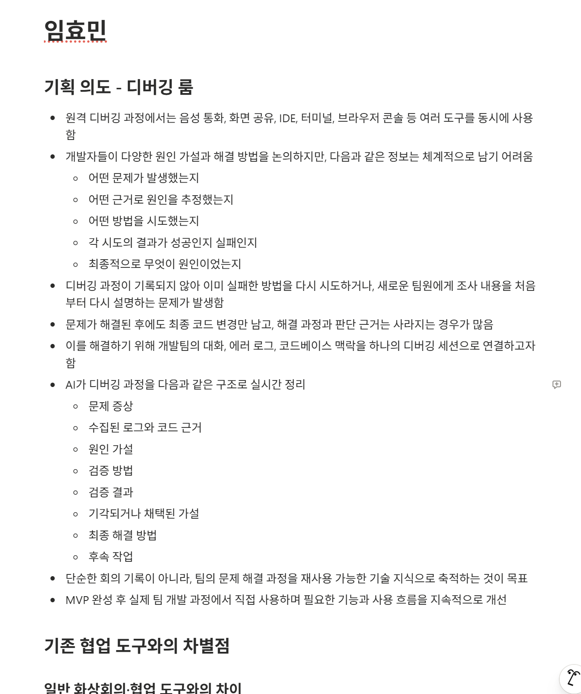
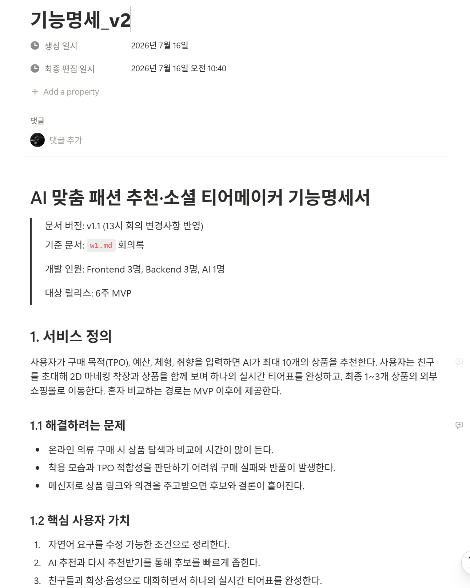
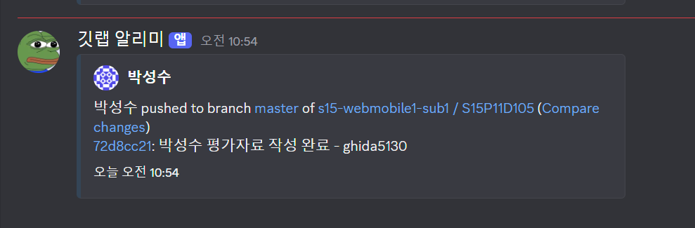

# 15기 공통프로젝트 D105 Sub1 평가자료

- 이름: 임효민
- 담당 역할: AI
- 평가 범위: 프로젝트 기획 단계

## 기획 단계 기여 요약

AI 담당으로서 아이디어 제안에 그치지 않고, **아이디어 구체화 → 팀 주제 선정 → AI 기술 구현 가능성 검토 → 기능명세 작성 → WBS 작성 → 협업 환경 구성**까지 기획 전 과정에 참여했다. 특히 주제가 패션 서비스로 확정된 뒤에는 AI 기능의 이상적인 형태와 6주 안에 구현 가능한 MVP 범위를 구분하고, 이를 팀 전체가 개발과 QA의 기준으로 사용할 수 있는 문서로 구체화했다.

## 주요 수행 내용

### 1. AI 협업 서비스 아이디어 제안

초기 아이디어 회의에서 WebRTC 기반의 **AI 협업/화상회의 서비스**를 제안했다. 화상 통화와 화면 공유에 AI를 결합해 음성 로그를 STT로 변환하고, 회의록과 TODO를 자동 생성하며, 프로젝트 레포지토리의 코드 맥락까지 함께 분석하는 서비스였다.

아이디어 보완 단계에서는 이를 **AI 페어 디버깅 룸**으로 구체화했다. 일반적인 회의 요약에 머무르지 않고 다음 정보를 하나의 디버깅 세션으로 관리하도록 설계했다.

- 문제 증상과 관련 로그·코드 근거
- 논의된 원인 가설과 검증 방법
- 가설별 검증 결과 및 채택·기각 상태
- 최종 해결 방법과 후속 TODO
- 새로운 팀원이나 다음 담당자에게 전달할 수 있는 디버깅 리포트

또한 Git 레포지토리를 사전에 등록·인덱싱하여 프로젝트 코드에 근거한 원인 후보를 제시하고, MVP 완성 후 팀 개발 과정에서 직접 사용하면서 개선하는 방향까지 제안했다. 이를 통해 일반 화상회의 도구나 개인용 AI 코딩 도구와 달리, **개발팀의 공동 문제 해결 과정 자체를 지원하고 기술 지식으로 축적한다**는 차별점을 만들었다.

### 2. 아이디어 보완 및 팀 주제 선정 참여

팀 미팅 전에는 제안한 AI 협업 서비스의 문제 정의, 핵심 사용자, 사용 시나리오, 차별점, AI 활용 방식을 보완했다. 이후 팀원들과 각 아이디어의 필요성, WebRTC 활용 당위성, AI 적용 가능성, 데이터 확보 가능성, 차별화 요소를 비교했다.

팀 논의 결과 프로젝트 주제는 **AI 맞춤 패션 추천과 실시간 소셜 티어메이커를 결합한 패션 서비스**로 정해졌다. 주제 확정 과정에서 개인 아이디어만 고수하지 않고, 팀의 최종 선택에 맞추어 AI 담당 관점의 검토와 후속 기획으로 빠르게 전환했다.

### 3. 패션 AI 기술 구현 가능성 검토

패션 주제 확정 후 회의록을 바탕으로 팀원들과 AI 기능의 구현 가능성에 대한 피드백을 주고받았다. 주요 검토 쟁점은 다음과 같았다.

- 상품 사진만으로 사용자 또는 아바타에게 옷을 입히는 것이 가능한지
- 2D 가상 착장과 3D 아바타 중 6주 MVP에 적합한 방식이 무엇인지
- 체형과 실제 사이즈·핏을 어느 수준까지 반영하고 보장할 수 있는지
- 공개 모델의 성능, GPU 요구량, 라이선스와 데이터 사용 제약
- 사용자 전신 사진과 신체 정보 수집에 따른 개인정보 위험
- 실시간 화상방에서 착장 결과와 공동 티어표를 안정적으로 동기화하는 방법
- AI 추론 실패나 착장 에셋 미지원 시 사용자 흐름을 유지할 대체 방식

이 논의를 기능 범위에 반영하여, MVP에서는 사용자 사진 기반 VTON과 정밀한 3D 아바타를 제외하고 **2D 마네킹과 사전 전처리된 의상 착장 에셋**을 사용하는 방향으로 범위를 조정했다. AI 기능은 자연어 TPO 조건 구조화, 상품 추천·리롤, 의상 에셋 전처리에 집중하고, 실패 시 수동 조건 입력·규칙 기반 추천·원본 상품 이미지 표시로 전체 흐름을 완주할 수 있도록 설계했다. 이로써 기술적 도전성은 유지하면서도 일정 내 완성 가능성을 높였다.

### 4. `기능명세_v2` 초기 페이지 전체 작성

팀의 기능 논의를 실제 개발 기준으로 전환하기 위해 **`기능명세_v2` 초기 페이지를 전체 작성**했다. 단순 기능 목록이 아니라 다음 내용을 하나의 기준 문서로 정리했다.

- 서비스 정의, 해결하려는 문제와 핵심 사용자 가치
- P0·P1·P2 우선순위와 MVP 포함·제외 범위
- 회원·방장·참여자·게스트의 권한
- 가입부터 AI 추천, 화상방, 공동 티어 분류, 외부 구매까지의 전체 사용자 흐름
- 화면 목록과 기능별 상세 동작
- 예외·정책 및 QA 판정에 사용할 인수 조건(AC)
- AI 조건 파서, 추천 랭커, 추천 설명, 의상 착장 에셋 전처리 명세
- REST API와 WebSocket/WebRTC 이벤트 계약 초안
- 핵심 데이터 모델, 성능·보안·개인정보 등 비기능 요구사항
- 공통 완료 정의(DoD), 오픈 이슈, 의사결정 시한과 실패 시 대체안

이 문서를 통해 프론트엔드·백엔드·AI가 같은 범위와 용어를 기준으로 병렬 작업할 수 있게 했고, 개발 완료 여부를 주관적 판단이 아닌 인수 조건과 테스트 결과로 확인할 수 있는 기반을 마련했다.

### 5. `WBS 초안` 초기 페이지 전체 작성

기능명세를 실제 일정과 담당 업무로 전환하기 위해 **`WBS 초안` 초기 페이지를 전체 작성**했다. 6주 일정과 Frontend 3명, Backend 3명, AI 1명의 팀 구성을 기준으로 다음 내용을 설계했다.

- 전체 210인일 중 175인일을 계획 작업으로 배정하고 35인일의 통합·리뷰·변경 대응 버퍼 확보
- 역할별 기능 오너십과 교차 리뷰 책임 정의
- M0~M6 마일스톤과 각 단계의 통과 기준·실패 시 축소안
- 주차별 FE·BE·AI 목표와 통합 산출물
- 역할별 상세 작업, 예상 공수, 선행 의존성, 완료 기준
- API·이벤트·AI 입출력 계약의 초안 및 동결 일정
- 핵심 E2E 시나리오와 기능 동결 진입 조건
- AI 품질, 상품 데이터, 착장 에셋, WebRTC, 일정 초과 위험에 대한 대응 계획

특히 AI 담당 업무를 조건 파서, 추천 랭커, 선택 리롤, 착장 에셋 PoC·전처리, 평가셋과 회귀 평가, 모델·프롬프트 고정 및 라이선스 점검으로 세분화했다. 또한 각 AI 작업이 백엔드 API와 프론트엔드 화면에 언제 연결되어야 하는지 의존성을 명시하여, AI 개발이 독립적으로 지연되거나 통합 시점에 병목이 생기지 않도록 계획했다.

### 6. Discord–GitLab 알림 채널 구성

기획 문서 작성 이후에는 팀 Discord에 웹훅을 연결하여 **GitLab 알림 전용 채널**을 구성했다. 팀원들이 별도로 GitLab을 반복 확인하지 않아도 저장소의 변경 알림을 같은 협업 공간에서 확인할 수 있도록 하여, 이후 개발 단계의 변경 공유와 협업 기반을 마련했다.

## 핵심 성과

| 구분 | 기여 | 팀에 미친 효과 |
| --- | --- | --- |
| 아이디어 제안 | AI 페어 디버깅 룸 제안 및 고도화 | AI·WebRTC를 결합한 구체적인 서비스 대안 제공 |
| 주제 선정 | 아이디어 비교와 팀 미팅 참여 | 개인 아이디어에서 팀의 패션 주제로 유연하게 전환 |
| 기술 타당성 | 2D/3D 착장, 데이터, 라이선스, 개인정보, 실패 대체 흐름 검토 | 도전적인 AI 기능을 완성 가능한 MVP 범위로 조정 |
| 기능명세 | `기능명세_v2` 초기 페이지 전체 작성 | 개발·QA의 공통 기준과 FE·BE·AI 계약 수립 |
| 일정 계획 | `WBS 초안` 초기 페이지 전체 작성 | 역할·공수·의존성·마일스톤·위험을 가시화 |
| 협업 환경 | Discord–GitLab 웹훅 알림 채널 구성 | 저장소 변경 공유의 접근성과 즉시성 향상 |
