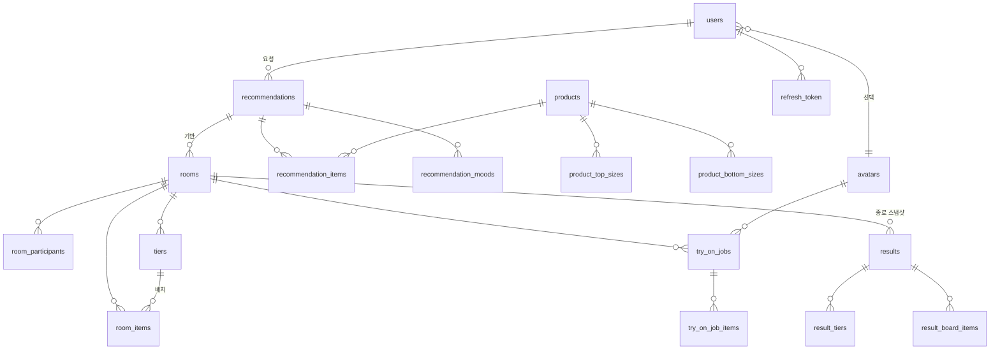

# 고르디(Gordi) 프로젝트 구조 및 개발 현황

> 기준 커밋: `38b8b07` / 기준 브랜치: `be/feat/common-response`
> 작성일: 2026-07-29

이 문서는 현재 리포지토리에 **실제로 존재하는 코드**를 기준으로 폴더 구조와 구현 상태를 정리한 것입니다.
기획 문서가 아니라 "지금 무엇이 돌아가고, 무엇이 아직 껍데기인지"를 파악하기 위한 개발자용 현황표입니다.

---

## 1. 서비스 개요

엔티티 구조로부터 파악되는 서비스 흐름은 다음과 같습니다.

1. 사용자가 **카테고리 · 예산 · 무드**를 입력하면 상품(`products`)을 추천받습니다. (`recommendations`)
   Spring이 판매 상태·카테고리·예산을 필터링하고 FastAPI가 순위를 계산합니다.
2. 추천 결과를 가지고 **방(`rooms`)** 을 만들고, 여러 참가자(`room_participants`)가 들어와
   상품을 **티어별로 배치**합니다. (`tiers`, `room_items`) — 이른바 "티어메이커"
3. 배치된 옷을 **아바타(`avatars`)에 가상 피팅**합니다. (`try_on_jobs`, `try_on_job_items`)
4. 방이 종료되면 **결과 스냅샷**으로 보존합니다. (`results`, `result_tiers`, `result_board_items`)

현재 코드로 **동작하는 범위는 1번까지**(회원/인증 + 추천 4개 API)입니다.
2~4번은 DB 스키마(JPA 엔티티)와 화면 프로토타입만 존재하고 비즈니스 로직은 아직 없습니다.

---

## 2. 기술 스택

| 영역 | 스택 |
| --- | --- |
| Backend | Java 21, Spring Boot 4.1.1-SNAPSHOT, Spring Security, Spring Data JPA, Validation, WebSocket(의존성만), JJWT 0.12.3, springdoc-openapi 2.8.5 |
| AI | Python, FastAPI, Uvicorn, pydantic-settings, pytest |
| Frontend | React 19, Vite 8, React Router 7, TanStack Query 5, Zustand 5, Axios, Tailwind CSS 4 |
| Infra | MySQL 8.4, Redis 7, RabbitMQ 4, Nginx(리버스 프록시), Docker Compose, Jenkins |

> Spring Boot는 정식 릴리스가 아닌 **SNAPSHOT** 버전을 사용하고 있습니다(`repo.spring.io/snapshot` 등록).
> Jackson 패키지가 `tools.jackson.*`인 것도 이 때문입니다(Jackson 3).

---

## 3. 전체 폴더 구조

```
D105/
├── .env / .env.example        # 모노레포 공용 환경변수 (BE/AI/FE 모두 여기서 읽음)
├── docker-compose.yml         # 인프라 (MySQL, Redis, RabbitMQ)
├── docker-compose.local.yml   # 로컬 앱 (backend + frontend + nginx)
├── docker-compose.prod.yml    # 운영 앱 (backend + frontend, nginx 없음)
├── default.conf               # 루트 Nginx: / → frontend, /api/ → backend
├── Jenkinsfile                # 백엔드 빌드 & prod compose 배포 파이프라인
│
├── backend/                   # Spring Boot API 서버
├── ai/                        # FastAPI AI 서버
├── frontend/                  # React SPA
│
└── docs/
    ├── 01_중간평가1 ~ 04_최종평가/   # 평가 산출물
    ├── images/                      # 팀원별 산출물 이미지
    └── PROJECT_OVERVIEW.md          # (이 문서)
```

### 3.1 Backend

```
backend/src/main/java/com/ssafy/backend/
├── BackendApplication.java
├── common/
│   ├── response/ApiResponse.java          # 성공 응답 래퍼 { "data": ... }
│   └── error/
│       ├── ErrorCode.java                 # HTTP 상태 + 메시지 + retryable 을 묶은 에러 코드 enum
│       ├── ApiException.java              # 서비스 계층에서 던지는 비즈니스 예외
│       ├── ErrorResponse.java             # 공통 오류 JSON 구조
│       ├── CustomControllerAdvice.java    # @RestControllerAdvice 전역 예외 변환
│       ├── ApiErrorResponseWriter.java    # Security 필터용 오류 JSON 직접 작성
│       └── RequestIdUtils.java            # X-Request-ID 조회/생성
├── config/
│   ├── SecurityConfig.java                # STATELESS + JWT 필터 체인 + 인가 규칙
│   ├── OpenApiConfig.java                 # Swagger, 전역 bearerAuth
│   ├── AiClientConfig.java                # FastAPI 호출용 RestClient (타임아웃 포함)
│   └── RecommendationPolicy.java          # 예산 정책·추천 개수·스키마 버전 단일 출처
├── controller/  AuthController, UserController, RecommendationController
├── service/     AuthService, UserService(UserDetailsService), JwtService,
│                RecommendationService, RecommendationRankClient, IdempotencyService
├── filter/      LoginFilter(JSON 로그인), JWTFilter(액세스 토큰 인가)
├── handler/     LoginSuccessHandler, LogoutSuccessHandler
├── util/        JWTUtil(토큰 생성·검증), CookieUtil(refreshToken 쿠키)
├── repository/  UserRepository, RefreshRepository, ProductRepository,
│                Recommendation/RecommendationItem/RecommendationMood,
│                RoomRepository, IdempotencyRecordRepository
├── domain/      엔티티 19종 + 코드 enum (아래 4.4 참고)
└── dto/         JWTResponseDTO, UserRequestDTO, UserResponseDTO,
                 RecommendationOptions/Request/Response/Condition/ItemResponse,
                 SuggestedBudget, Replacement(Request/Response), ReplacedItem,
                 ai/Rank(Request/Response/Condition/Candidate/RankedProduct)
```

테스트: `ApiResponseTest`, `CustomControllerAdviceTest`, `RecommendationOptionsResponseTest`,
`RecommendationServiceTest`, `BackendApplicationTests` (총 28종)

### 3.2 AI

```
ai/
├── run.py                     # uvicorn 실행 엔트리
├── requirements.txt / pyproject.toml
├── app/
│   ├── main.py                     # create_app(): CORS + api_router(/api/v1) + internal_router(/internal/v1)
│   ├── core/config.py              # 모노레포 루트 .env 를 읽는 pydantic Settings
│   ├── api/router.py               # 공개 라우터
│   ├── api/internal_router.py      # 서비스 간 내부 라우터
│   ├── api/deps.py                 # X-Internal-Api-Key 검증 (키 미설정이면 통과)
│   ├── api/routes/health.py        # GET /api/v1/health
│   ├── api/routes/recommendations.py  # POST /internal/v1/recommendations/rank
│   ├── schemas/recommendation.py   # Rank 요청·응답 (camelCase alias)
│   └── services/ranking.py         # 무드·예산·세부분류·메타데이터 가중 스코어링
└── tests/test_health.py, tests/test_recommendations.py
```

### 3.3 Frontend

```
frontend/src/
├── main.jsx                   # QueryClientProvider → App
├── App.jsx                    # RouterProvider
├── routes/router.jsx          # 라우팅 단일 관리
├── layouts/RootLayout.jsx     # 현재는 <Outlet/> 만
├── lib/
│   ├── httpClient.js          # httpClient(공개) / authHttpClient(인증) 두 인스턴스
│   └── queryClient.js         # staleTime 60s, retry 1 등 전역 정책
├── api/
│   ├── request.js             # publicApi / authApi (get·post·put·patch·delete)
│   ├── auth.js                # login, logout
│   ├── posts.js               # getPosts (예제용)
│   └── errors.js              # AuthRequiredError
├── utils/
│   ├── tokenStorage.js        # localStorage accessToken
│   └── apiError.js            # 에러 → 사용자 메시지 변환
├── stores/useUserStore.js     # zustand + persist, 화면 표시용 사용자 정보
├── pages/                     # HomePage, ApiExamplePage, TierMakerRoomPage,
│                              # NotFoundPage, RouteErrorPage
└── components/
    ├── common/PageContainer.jsx
    └── tierMaker/             # TierBoard, ClothingCatalog, ClothingArtwork,
                               # FittingPanel, ParticipantDock, TierMakerIcon
```

프론트엔드 작업 규칙은 `frontend/agents.md`에 정리되어 있습니다(중복 인스턴스 금지, API 함수는 `src/api`에만 등).

---

## 4. 백엔드 구현 상세

### 4.1 공통 응답 계약

성공은 `data`로 감싸고, 실패는 별도 구조를 씁니다. 자세한 사용 가이드는 `backend/README.md`에 있습니다.

```json
// 성공
{ "data": { "email": "gordi@example.com", "nickname": "홍길동" } }

// 실패
{
  "code": "ROOM_NOT_FOUND",
  "message": "방을 찾을 수 없습니다.",
  "details": { "roomId": 31 },
  "requestId": "uuid",
  "retryable": false
}
```

오류 경로는 두 가지로 나뉩니다.

| 발생 위치 | 처리 주체 |
| --- | --- |
| 컨트롤러/서비스 (`ApiException`, Validation 등) | `CustomControllerAdvice` |
| Security 필터 (토큰 만료, 로그인 실패, 401/403) | `ApiErrorResponseWriter` |

`ErrorCode`에는 현재 **24개** 코드가 정의되어 있고, 아직 구현되지 않은 기능(방 정원 초과, 버전 충돌, 멱등 키 재사용, 이미지 생성 한도 등)까지 미리 선언되어 있습니다.

### 4.2 인증 구조

- **세션 미사용**(`STATELESS`), CSRF·formLogin·httpBasic 비활성화
- 로그인은 커스텀 `LoginFilter`가 `POST /api/v1/auth/login` JSON 본문(`email`, `password`)을 직접 파싱
- 토큰은 `type` 클레임(`access` / `refresh`)으로 구분, HMAC-SHA 서명
- **Access Token**: 응답 body로 반환 → 프론트가 localStorage 보관 → `Authorization: Bearer` 헤더
- **Refresh Token**: `HttpOnly` 쿠키(`refreshToken`) + DB(`refresh_token` 테이블) 저장
- **RTR(Refresh Token Rotation)**: 재발급 시 기존 refresh 삭제 후 새로 저장, DB에 없는 토큰은 거부
- 로그아웃/회원 탈퇴 시 해당 사용자의 refresh 토큰 폐기

```
POST /auth/login
  → LoginFilter → AuthenticationManager → UserService.loadUserByUsername
  → LoginSuccessHandler : accessToken(body) + refreshToken(HttpOnly Cookie) + DB 저장

이후 요청
  → JWTFilter : Bearer 검증 → SecurityContext 에 인증 저장
  → 실패 시 TOKEN_EXPIRED / INVALID_TOKEN
```

### 4.3 API 목록 (현재 구현된 것 전부)

| Method | Path | 인증 | 설명 |
| --- | --- | --- | --- |
| POST | `/api/v1/auth/signup` | 없음 | 회원가입, `201` + `{ userId }` |
| POST | `/api/v1/auth/login` | 없음 | 로그인, accessToken 반환 + refresh 쿠키 |
| POST | `/api/v1/auth/logout` | 쿠키 | refresh 폐기, `204` |
| POST | `/api/v1/auth/refresh` | 쿠키 | RTR 재발급 |
| POST | `/api/v1/auth/exchange` | 쿠키 | 쿠키 refresh → body 토큰 교환(모바일 등) |
| GET | `/api/v1/recommendation-options` | ROLE_USER | 카테고리·세부 분류·무드·예산 정책·추천 개수 조회 |
| POST | `/api/v1/recommendations` | ROLE_USER | 조건 기반 추천 스냅샷 생성, `201` |
| GET | `/api/v1/recommendations/{id}` | ROLE_USER | 저장된 추천 스냅샷 조회 |
| POST | `/api/v1/recommendations/{id}/replacements` | ROLE_USER | 선택 상품 교체 및 새 버전 생성 |
| POST | `/internal/v1/recommendations/rank` (AI) | 내부 키 | 후보 상품 순위 계산 |
| GET | `/api/v1/users/me` | ROLE_USER | 내 정보 조회 |
| PATCH | `/api/v1/users/me` | ROLE_USER | 닉네임 수정 |
| GET | `/api/v1/users` | ROLE_USER | 내 정보 조회 (`/me`와 동일 동작) |
| PUT | `/api/v1/users` | ROLE_USER | 회원 수정 (`PATCH /me`와 동일 동작) |
| DELETE | `/api/v1/users` | ROLE_USER | 회원 탈퇴 |
| POST | `/api/v1/users/exist` | ROLE_USER | 이메일 존재 확인 |
| GET | `/api/v1/health` (AI) | 없음 | AI 서버 상태 |

Swagger: `/api/swagger-ui.html`, OpenAPI JSON: `/api/v3/api-docs`

### 4.4 도메인 엔티티 (18종)

JPA 엔티티는 **전부 작성되어 있고**(`spring.jpa.hibernate.ddl-auto=update`로 테이블 자동 생성),
리포지토리가 있는 것은 `User`, `RefreshToken`, `Product`, `Recommendation`, `RecommendationItem`,
`RecommendationMood`, `Room`, `IdempotencyRecord`입니다.
추천 기능을 위해 `Product.availability` 컬럼과 `idempotency_records` 테이블이 추가되었고,
코드 값은 `CategoryCode`/`SubcategoryCode`/`MoodCode`/`RecommendationStatus`/`EmptyReason`/`ProductAvailability` enum으로 관리합니다.



| 그룹 | 엔티티 | 비고 |
| --- | --- | --- |
| 사용자/인증 | `User`, `RefreshToken` | `User`에 `provider`/`providerId` 필드가 있으나 소셜 로그인 미구현 |
| 아바타 | `Avatar` | 성별표현·체형·비율 + 이미지 URL, `is_default`/`is_active` 플래그 |
| 상품 | `Product`, `ProductTopSize`, `ProductBottomSize` | 상의/하의 실측 사이즈 분리 |
| 추천 | `Recommendation`, `RecommendationItem`, `RecommendationMood` | 예산 범위, 무드 다중 선택, 결과 없을 때 `emptyReason` + 추천 예산 제안 필드 보유 |
| 방/티어 | `Room`, `RoomParticipant`, `Tier`, `RoomItem` | `Room`에 `@Version` 낙관적 락, `roomCode`, `expiresAt` |
| 가상 피팅 | `TryOnJob`, `TryOnJobItem` | 슬롯 기반 착장 구성 |
| 결과 | `Result`, `ResultTier`, `ResultBoardItem` | 방 종료 시점 불변 스냅샷 |

---

## 5. 프론트엔드 구현 상세

| 라우트 | 페이지 | 상태 |
| --- | --- | --- |
| `/` | `HomePage` | 초기 세팅 확인용 랜딩(스택 소개, 환경변수 출력) |
| `/examples/api` | `ApiExamplePage` | 로그인/로그아웃 + 일반 조회 요청 흐름 **학습용 예제** |
| `/tierm` | `TierMakerRoomPage` | 티어메이커 UI 프로토타입, **데이터 전부 하드코딩** |
| `*` | `NotFoundPage` | 404 |
| (에러) | `RouteErrorPage` | 라우트 예외 |

**API 요청 규약**

- `publicApi`: 토큰 불필요한 공개 요청
- `authApi`: 토큰 필수. 토큰이 없으면 요청 전에 `AuthRequiredError`로 중단하고,
  응답 `401`이면 localStorage 토큰 삭제 + 유저 스토어 초기화
- 서버 상태는 TanStack Query, 클라이언트 상태는 Zustand(`persist`로 사용자 정보만 보관)

**티어메이커 프로토타입**(`TierMakerRoomPage` + `components/tierMaker/`)

- 의류 8종을 상수로 정의하고 카테고리별 카탈로그 → 티어 보드 배치 → 피팅 패널 미리보기까지 화면 흐름만 구현
- 옷 이미지는 실제 이미지가 아니라 `ClothingArtwork`의 SVG 일러스트
- 참가자 목록(`ParticipantDock`)도 목데이터, 실시간 동기화(WebSocket) 미연결

---

## 6. 인프라 및 배포

```
                        ┌──────────── Nginx (:80) ────────────┐
   브라우저 ──────────▶ │  /      → gordi-frontend:80 (정적)  │
                        │  /api/  → gordi-backend:8080        │
                        └─────────────────────────────────────┘
                                        │
              ┌─────────────────────────┼──────────────────────────┐
        gordi-mysql:3306        gordi-redis:6379        gordi-rabbitmq:5672
```

- 컨테이너들은 외부에서 미리 만든 도커 네트워크 `app-network`에 참여합니다(`external: true`).
- `docker-compose.yml`(인프라)와 `docker-compose.local.yml`/`prod.yml`(앱)이 분리되어 있어,
  인프라를 먼저 올린 뒤 앱을 올리는 순서입니다.
- 프론트엔드는 멀티스테이지 빌드(`node:22-alpine` → `nginx:alpine`)로 정적 서빙하며 `/health` 엔드포인트를 제공합니다.
- 백엔드도 멀티스테이지(`eclipse-temurin:21-jdk-alpine`)로 `bootJar` 생성 후 실행합니다.
- **Jenkins**: `backend/**` 변경 시 GitLab Webhook → Gradle 빌드(`-x test`) → Credentials의 `.env` 주입 → `docker-compose.prod.yml` 재배포.
  프론트엔드 `.env` 주입 부분은 주석 처리된 상태입니다.

### 로컬 실행

```bash
docker compose up -d                                        # 인프라
docker compose -f docker-compose.local.yml up -d --build     # 앱
# http://localhost/ , http://localhost/api/ , http://localhost/api/swagger-ui/index.html
```

AI 서버는 컴포즈에 포함되어 있지 않아 별도로 실행합니다.

```bash
cd ai && python -m venv .venv && .\.venv\Scripts\Activate.ps1
pip install -r requirements.txt && python run.py    # http://localhost:8000/docs
```

### 환경변수

`.env` 하나를 세 서비스가 공유합니다.

| 서비스 | 읽는 방식 |
| --- | --- |
| Backend | `application.properties`의 `spring.config.import=optional:file:.env[.properties]` (루트/backend 양쪽 경로 지원) |
| AI | `app/core/config.py`가 모노레포 루트 `.env`를 직접 지정 |
| Frontend | Vite의 `VITE_*` 접두사 변수 |

주요 키: `MYSQL_*`, `REDIS_*`, `RABBITMQ_*`, `JWT_SECRET`, `JWT_ACCESS_EXPIRATION`(1시간), `JWT_REFRESH_EXPIRATION`(7일), `VITE_API_BASE_URL`, `VITE_AI_API_BASE_URL`. 템플릿은 `.env.example` 참고.

추천 기능 추가분: `AI_INTERNAL_BASE_URL`(Spring → FastAPI), `AI_CONNECT_TIMEOUT_MS`, `AI_READ_TIMEOUT_MS`,
`INTERNAL_API_KEY`(Spring은 헤더로 전송, FastAPI는 검증. **비워두면 검증하지 않음**).
추천 정책 값(`gordi.recommendation.*`)은 `application.properties`에서 관리합니다.

---

## 7. 개발 현황 요약

| 기능 | 상태 | 근거 |
| --- | --- | --- |
| 공통 성공/오류 응답 계약 | ✅ 완료 | `ApiResponse`, `ErrorCode`(24종), `CustomControllerAdvice`, `ApiErrorResponseWriter` + 단위 테스트 |
| 회원가입 / 로그인 / 로그아웃 | ✅ 완료 | `AuthController`, `LoginFilter`, `LoginSuccessHandler` |
| JWT 발급·검증, RTR 재발급 | ✅ 완료 | `JWTUtil`, `JwtService`, `JWTFilter` |
| 회원 조회 / 수정 / 탈퇴 | ✅ 완료 | `UserController`, `UserService` |
| Swagger 문서화 | ✅ 완료 | `OpenApiConfig` (전역 bearerAuth) |
| DB 스키마 (엔티티 18종) | ✅ 완료 | `domain/` — 단, 리포지토리·서비스는 3개 도메인만 |
| 프론트 공통 API/상태 레이어 | ✅ 완료 | `httpClient`, `request.js`, `queryClient`, `useUserStore` |
| Docker / Nginx / Jenkins 파이프라인 | ✅ 완료 | 루트 compose 3종, `Jenkinsfile` |
| 상품 추천 (4개 API) | ✅ 완료 | `RecommendationController/Service`, `RecommendationRankClient`, `IdempotencyService` + 단위 테스트 23종 |
| AI 순위 계산 | ✅ 완료 | `POST /internal/v1/recommendations/rank`, `app/services/ranking.py` + pytest |
| 티어메이커(방/티어/참가자) | 🟡 화면만 | 프론트 프로토타입 + 엔티티. API·WebSocket 없음 |
| 가상 피팅(Try-On) | ⬜ 미착수 | 엔티티만 존재 |
| 결과 저장/공유 | ⬜ 미착수 | 엔티티만 존재 |
| 소셜 로그인 | ⬜ 미착수 | `User.provider` 필드만 예약 |
| Redis / RabbitMQ 연동 | ⬜ 미착수 | 컨테이너·프로퍼티는 있으나 `build.gradle`에 스타터 미추가 |
| 실시간 통신 | ⬜ 미착수 | `spring-boot-starter-websocket` 의존성만, 설정·핸들러 없음 |

### 추천 API 처리 흐름

```
POST /api/v1/recommendations
  → 카테고리·세부분류·무드 코드 검증 (enum) → 예산 검증 (INVALID_BUDGET_RANGE / 정책 범위)
  → Idempotency-Key 재생 확인
  → recommendations 저장(version=1) + recommendation_moods 저장
  → products 필터 (availability=AVAILABLE, category, subcategory, price BETWEEN)
      · 후보 없음 → status=EMPTY + emptyReason + suggestedBudget (예산 자동 확대 없음)
      · 후보 있음 → FastAPI /internal/v1/recommendations/rank → 상위 N개를 recommendation_items 저장
  → 201 CREATED

POST /api/v1/recommendations/{id}/replacements
  → 소유자 확인 → baseVersion 비교 (다르면 409 VERSION_CONFLICT)
  → recommendation_items 전 버전에서 노출된 모든 product_id 수집 → 후보에서 제외
  → FastAPI 재호출 → version+1 로 전체 항목 재저장 (교체 자리만 새 상품·새 점수, 나머지는 순위 유지)
  → replaced / unreplacedProductIds 반환
```

FastAPI 호출 실패·응답 이상은 `503 DEPENDENCY_UNAVAILABLE`(retryable)로 변환됩니다.

---

## 8. 다음 작업 시 확인할 점

코드를 읽다 발견한, 다음 기능 구현 전에 정리하면 좋을 항목들입니다.

**추천 기능 구현 시 정한 것**

1. `Product.availability`(기본값 `AVAILABLE`) 필드를 추가하고 `ProductRepository` 쿼리를 되살렸습니다.
   추천 후보는 `AVAILABLE` 상품만 사용합니다.
2. 카테고리·세부 분류·무드는 `CategoryCode`/`SubcategoryCode`/`MoodCode` enum이,
   예산 정책·추천 개수·스키마 버전은 `RecommendationPolicy`(프로퍼티 주입)가 단일 출처입니다.
   프론트엔드는 `GET /api/v1/recommendation-options`로 받아 씁니다(`src/api/recommendations.js`).
3. `Idempotency-Key`는 **있으면 적용, 없으면 그대로 수행**입니다. 같은 키 + 같은 본문이면
   저장된 응답(`idempotency_records.response_body`)을 그대로 돌려주고, 같은 키 + 다른 본문이면
   `409 IDEMPOTENCY_KEY_REUSED`입니다.
4. 재추천에서 **교체 후보가 하나도 없으면 새 버전을 만들지 않습니다.** 현재 버전을 그대로 두고
   `replaced: []`, `unreplacedProductIds`에 요청 전체를 담아 반환합니다(버전 증가 낭비 방지).
5. 추천 조회 권한은 `본인 소유 || 그 추천을 참조하는 방의 호스트`까지만 확인합니다.
   `RoomParticipant`에 `user_id`가 없어 **게스트 참가자 권한은 아직 검증할 수 없습니다** — 방 API 작업 시 함께 처리해야 합니다.

**정합성 이슈**

6. `POST /api/v1/users/exist`는 이메일 중복 확인용이지만, `SecurityConfig`에서 `/api/v1/users/**`에
   `hasRole("USER")`가 걸려 있어 **회원가입 전에는 호출할 수 없습니다.** 경로를 `/auth` 아래로 옮기거나 permitAll 필요.
7. `UserRequestDTO.email`의 검증이 `@Size(4~20)`뿐이라 **이메일 형식 검증이 없습니다**(`@Email` 미적용).
   메시지도 "아이디"로 되어 있어 필드명과 어긋납니다.
8. `JwtService.refreshRotate()`가 `ApiException` 대신 `RuntimeException`을 던져
   공통 오류 계약을 벗어나 `500 INTERNAL_SERVER_ERROR`로 응답합니다. 같은 클래스의 `cookie2Header()`는
   `ApiException`을 쓰고 있어 두 메서드가 서로 다릅니다.
9. `UserController`에 `/me` 계열과 루트 경로 계열이 **동일 동작으로 중복**되어 있습니다(`GET /users` = `GET /users/me`).
10. 프론트 `api/auth.js`는 `/auth/login`을 호출하므로 `VITE_API_BASE_URL`에 `/api/v1`까지 포함되어야 합니다.
    `.env.example`에는 `http://localhost:8080`으로만 되어 있습니다.
11. `api/posts.js`의 `/posts`, `ApiExamplePage`가 기대하는 로그인 응답 형태(`{ accessToken, user }`)는
    **백엔드에 존재하지 않는 예제 스펙**입니다. 실제 응답은 `{ data: { accessToken } }`입니다.

**운영 전 처리**

12. `CookieUtil.SECURE = false`, `SAME_SITE = "Strict"`가 하드코딩되어 있습니다. HTTPS 운영 시 프로파일별 주입 필요.
13. `spring.jpa.hibernate.ddl-auto=update` + `show-sql=true`가 운영 프로파일에도 그대로 적용됩니다.
14. Spring Boot가 SNAPSHOT 버전이므로 빌드 재현성이 보장되지 않습니다.
15. `backend/README.md` 마지막 줄에 병합 충돌 마커 `>>>>>>>`가 남아 있습니다.
16. `application.properties` 하단 주석이 인코딩 깨진 상태(`# ??? ???(HTTPS)...`)입니다.
17. `추천 API.pdf`의 예시 응답에는 `items: []`로 표기돼 있으나, 구현은 실제 추천 항목을 채워 반환합니다
    (예시가 생략된 것으로 판단). 프론트 연동 시 실제 응답을 기준으로 하세요.
