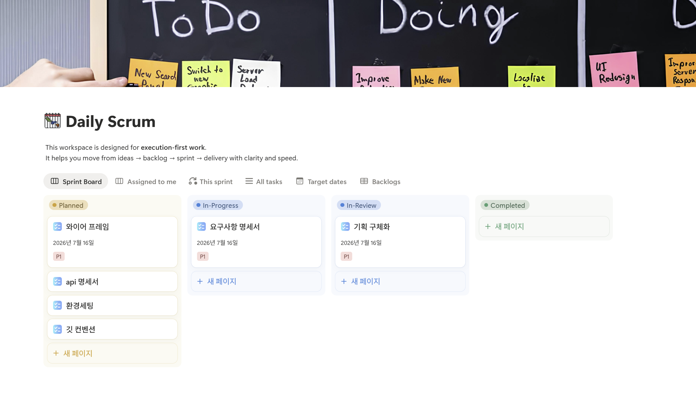

# 💻 프로젝트 브레인스토밍 및 기획 회의 아카이브
> **작성자**: 최보경 (Choi Bo-gyeong)  
> **역할**: 백엔드 팀장 / 회의 서기 / 기획·기능 구체화 담당  

---

## 📌 목차
1. [1단계: 아이디어 브레인스토밍 (개인 아이디어 발제)](#1단계-아이디어-브레인스토밍-개인-아이디어-발제)
2. [2단계: 1차 주제 선정 및 구체화 (AI 기반 코딩 테스트 스터디)](#2단계-1차-주제-선정-및-구체화-ai-기반-코딩-테스트-스터디)
3. [3단계: 최종 주제 피벗 및 기능 구체화 (2D 마네킹 패션 플랫폼)](#3단계-최종-주제-피벗-및-기능-구체화-2d-마네킹-패션-플랫폼)
4. [4단계: 협업 및 데일리 스크럼 기록](#4단계-협업-및-데일리-스크럼-기록)

---

## 1단계: 아이디어 브레인스토밍 (개인 아이디어 발제)

회의 초기 단계에서 실시간 통신 기술(WebRTC), 인공지능(AI), 그리고 사용자 경험(UX) 향상을 접목해 제안했던 아이디어 후보군 목록입니다.

### 1. 실시간 자동 모자이크 시스템
*   **문제 정의**: 브이로그 및 라이브 스트리밍 폭발적 성장 대비, 주변 행인의 초상권 및 차량 번호판 등 개인정보의 실시간 노출 리스크 존재. 사후 프레임 단위 수동 마스킹으로 인한 시간/비용 소모 극심.
*   **해결 방안**: WebRTC 라이브 스트림 상에서 딥러닝 기반으로 얼굴 및 번호판을 실시간 탐지·모자이크 처리.
*   **핵심 기능**: 인터뷰 대상자 등 특정 인물은 '허용 인물'로 등록하여 모자이크 제외 처리 기능 제공.

### 2. 실시간 설명형 학습 코칭 시스템
*   **문제 정의**: "이해한 것 같은 느낌"과 "실제로 설명할 수 있는 상태(인출)"의 격차 존재. 텍스트 기반 AI는 단순 답변 제공에 그쳐 학습자의 능동 인출을 유도하지 못함.
*   **해결 방안**: AI가 학생 역할을 하며 유저에게 역으로 질문을 던지는 실시간 음성 상호작용 시스템.
*   **핵심 기능**: 사용자가 설명하는 음성을 분석하여 오개념, 용어 누락을 실시간 감지 및 피드백.

### 3. 실시간 온라인 헬스장 (그룹 홈트레이닝)
*   **문제 정의**: 혼자 하는 홈트레이닝의 동기부여 부족, 프라이버시(얼굴/방 노출) 우려 및 잘못된 자세로 인한 부상 위험.
*   **해결 방안**: WebRTC를 통한 참여자 간 실시간 운동 현장감 공유 + 온디바이스 AI 기반 자세 추정(MediaPipe).
*   **핵심 기능**: 
    *   RTCDataChannel을 통한 실시간 운동 횟수/정확도 동기화 및 실시간 랭킹 시스템.
    *   개인정보 보호를 위한 실시간 얼굴 가리기(블러/아바타/실루엣/관절 포인트만 송출) 기능.

### 4. 청소년·청년 익명 상담 서비스
*   **콘셉트**: 내담자의 얼굴 노출 부담을 최소화한 프라이버시 보호형 화상 상담.
*   **핵심 기능**: 원본 영상 대신 아바타/실루엣/블러 처리 적용. 실시간 비언어적 신호(시선 이탈, 손 꼼지락거림 등)만 추출하여 상담사에게 객관적 메타데이터로 안내.

### 5. 온디바이스 AI 기반 시니어 안심 홈캠 '골든타임 케어'
*   **콘셉트**: 평상시에는 사생활 보호를 위해 영상을 절대 송출하지 않다가, 온디바이스 AI가 위험 상황(통증 모션, 낙상, 타격음) 감지 시에만 WebRTC 파이프라인을 오픈하는 보안 특화 케어캠.

### 6. 취업/B2B 밋업 화상 부스
*   **콘셉트**: 박람회 현장에서 대기 시간을 줄이기 위해 부스 내 태블릿을 통한 1:1 로테이션 화상 부스 매칭 서비스.

---

## 2단계: 1차 주제 선정 및 구체화 (AI 기반 코딩 테스트 스터디)

브레인스토밍 이후 진행된 회의를 통해 **"코딩 테스트 스터디 플랫폼"**을 1차 타겟 주제로 선정하고 세부 기획을 다졌습니다. (서기 및 기획 디테일 정교화 진행)

### 1. 기획 의도 및 문제 정의
*   **코드 해석 리소스 과다**: 스터디원 각자의 구현 스타일(변수명, 주석 스타일 등) 차이로 타인의 코드를 사전 이해하는 데 많은 시간 낭비 $\rightarrow$ 실제 리뷰는 형식적인 칭찬에 그침.
*   **풀이 과정 데이터의 소실**: 최종 제출 코드(성공본)만 공유하므로, 문제를 풀며 겪었던 시행착오(시간 초과로 인한 자료구조 변경, 삽질 과정 등)를 리뷰할 수 없음.
*   **참여 편중**: 실력이 우수하거나 스피킹이 유창한 소수에게만 스터디 세션 주도권이 집중됨.
*   **주먹구구식 문제 선정**: 팀원들의 실시간 수준이나 취약점을 전혀 파악하지 못해 무작위로 문제를 정함.

### 2. 서비스 핵심 정의
> **"푸는 과정은 실시간으로 공유하고, 성장은 데이터로 축적하는 AI 기반 알고리즘 스터디 스페이스"**

### 3. 페르소나 설계
*   **👤 페르소나 1: 박팀장 (25세, 스터디 방장) - "문제 선정에 피로감을 느끼는 스터디장"**
    *   *상황/문제*: 팀원의 취약 개념을 모른 채 무작위로 문제를 선정하다 보니 피로감을 느낌.
    *   *해결*: 스터디 후 에디터 이벤트 데이터(컴파일 에러 추이, 정체 구간)를 바탕으로 AI가 팀 전체의 취약점을 분석하고 최적의 다음 문제를 자동 추천함.
*   **👤 페르소나 2: 최초보 (23세, 스터디 팀원) - "코드 공유가 부려운 위축된 초심자"**
    *   *상황/문제*: 미완성 코드나 지저분한 스타일을 스터디원에게 보여주는 것에 대한 심리적 거부감.
    *   *해결*: AI가 개별 코드의 라인 단위 지적 대신, "초보님은 비록 미완성이지만 수학적 규칙을 바탕으로 완전탐색을 적극 시도했습니다"와 같이 발상(아이디어) 중심의 토론 분기점을 마련하여 심리적 안전감을 부여함. 타인과의 단순 줄 세우기 랭킹을 빼고, 과거의 나와 비교한 성장 추이 및 캐릭터 배지('🎨 클린코드 마스터')를 제공함.

### 4. 기술 분석 및 차별점
*   **데이터 수집 아키텍처**: 인텔리제이(IntelliJ) 플러그인을 활용하여 실시간 코드 변경 내역 리플레이 데이터를 JSON 데이터 형태로 수집.
    ```json
    {
      "timestamp": "00:08:42",
      "eventType": "CODE_CHANGE",
      "file": "Main.java",
      "addedLines": ["Queue<Integer> queue = new ArrayDeque<>();"],
      "removedLines": ["dfs(start);"]
    }
    ```
*   **외부 API 연동**: Codeforces API 및 LeetCode GraphQL 쿼리를 활용해 난이도별, 알고리즘 태그별 문제 본문 연동.
*   **차별성 요약**:
    *   기존 플랫폼: 결과(Pass/Fail)와 최종 제출물만 공유.
    *   **본 서비스**: 타이핑 정체 구간, 에러 추이를 추적하여 '사고의 전환점'을 시각화하고 맞춤형 피드백 제공.

---

## 3단계: 최종 주제 피벗 및 기능 구체화 (2D 마네킹 패션 플랫폼)

이후 회의 진행 상황에 따라 프로젝트 주제가 **"패션 및 2D 마네킹 기반 가상 피팅/스타일링 서비스"**로 최종 조율 및 피벗되었습니다. 이에 맞춰 계정, 프로필, 2D 마네킹 등 핵심 도메인에 대한 구체적인 기능 정의서 초안을 정교하게 다듬었습니다.

### 📋 핵심 기능 명세서 (초안 발췌)

| 기능 ID | 우선순위 | 기능/동작 | 상세 정의 및 세부 스펙 |
| :--- | :--- | :--- | :--- |
| **F-00-01** | P0 | 이메일과 비밀번호로 가입·로그인·로그아웃한다.<br>액세스 토큰 만료 시 재발급한다. | • 이메일 기반 기본 가입/인증 기능<br>• JWT 및 Refresh Token을 통한 안전한 세션 유지 |
| **F-00-02** | P0 | 초대 링크 사용자는 닉네임만 입력해 게스트로 방에 참여한다. | • 가입 허들을 최소화하여 협업/공유를 유연하게 만드는 게스트 계정 허용 |
| **F-00-02-1** | P2 | 아바타 관련 항목은 최초 설정 이후에도 언제든 추가 및 수정할 수 있다. | • 최초 가입 프로세스를 빠르게 통과한 뒤, 사후에 자유롭게 개인 아바타 수정 지원 |
| **F-00-03** | P0 | 사용자는 키와 몸무게를 수동으로 입력하고, 원하는 체형을 직접 선택하여 저장할 수 있다. | • 가상 피팅을 제공하기 위한 최소 신체 수치 저장<br>• 사용자가 인지하는 본인의 체형 선택 반영 |
| **F-00-04** | P0 | 사용자가 키, 몸무게, 체형을 입력하면 마네킹 후보를 제공하고 사용자는 선택할 수 있다. | • 입력값과 가장 일치하는 최적의 2D 마네킹 모델 후보군 매핑 및 매칭 처리 |
| **F-00-05** | P1 | 사용자는 마이페이지에서 프로필 정보 및 마네킹(체형/스타일)을 언제든 편집하거나 기본값으로 초기화할 수 있다. | • 마이페이지 내 사용자 체형 데이터 관리<br>• 스타일 태그 재설정 및 마네킹 초기화 도구 제공 |

---

## 4단계: 협업 및 데일리 스크럼 기록

공통 프로젝트 진행 상황을 투명하게 유지하고 일정 관리를 고도화하기 위해 매일 스크럼을 진행하며 업무 스코프를 기록했습니다.


### 📅 데일리 스크럼 일지 (Template 및 누적 관리)
    

*   **진행 방식**: 
    [Planned] ──(작업 시작)──> [In-Progress] ──(작업 완료/리뷰 요청)──> [In-Review] ──(승인/Merge)──> [Completed]
*   *이하 스크럼 기록은 프로젝트 백로그 세부 스케줄과 병행하여 지속 누적 중입니다.*